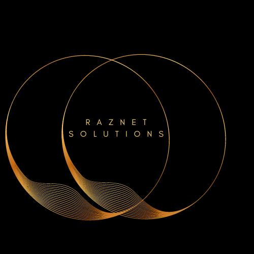

# Raznet Chat 🤖

An intelligent chat application powered by Streamlit, Ollama, and Deepseek that provides natural language interactions and document analysis capabilities.



## Features

- 💬 Natural language chat interface
- 📄 Document processing support (PDF, Word, Excel, CSV, TXT)
- 🎯 Context-aware responses
- 🎨 Modern, responsive UI
- ⚙️ Customizable model parameters
- 🔄 Real-time thinking process visualization
- 📱 Mobile-friendly design

## Supported File Types

- PDF Documents
- Word Documents (.docx)
- Excel Spreadsheets
- CSV Files
- Plain Text Files

## Installation

1. Clone the repository:
```bash
git clone https://github.com/Razworld00/raznet-chat.git
cd raznet-chat
```

2. Install dependencies:
```bash
pip install -r requirements.txt
```

3. Install Ollama and the Deepseek model:
```bash
# Install Ollama from https://ollama.ai/
ollama pull deepseek-r1:1.5b
```

4. Set up environment variables:
```bash
cp .env.example .env
# Edit .env with your configuration
```

## Usage

1. Start the Ollama service:
```bash
ollama serve
```

2. Run the Streamlit app:
```bash
streamlit run main.py
```

3. Open your browser and navigate to:
```
http://localhost:8501
```

## Configuration

You can customize the following parameters in the sidebar:
- Temperature (0.0 - 1.0)
- Max Tokens
- Show/Hide Thinking Process

## Environment Variables

Create a `.env` file with the following variables:
```
OLLAMA_HOST=http://localhost:11434
MODEL_NAME=deepseek-r1:1.5b
```

## Deployment

### Hugging Face Spaces
1. Create a new Space on Hugging Face
2. Select Streamlit as the SDK
3. Upload your files
4. Configure the environment variables

## Contributing

1. Fork the repository
2. Create your feature branch (`git checkout -b feature/amazing-feature`)
3. Commit your changes (`git commit -m 'Add some amazing feature'`)
4. Push to the branch (`git push origin feature/amazing-feature`)
5. Open a Pull Request

## License

This project is licensed under the MIT License - see the [LICENSE](LICENSE) file for details.

## Acknowledgments

- Built with Streamlit
- Powered by Ollama and Deepseek
- Created by Raz

## Contact

For questions and feedback, please open an issue on GitHub.
